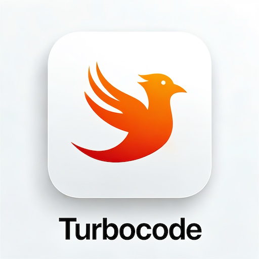
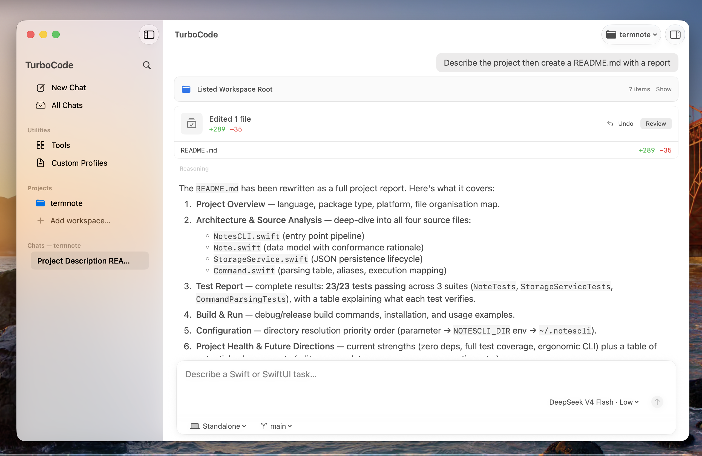
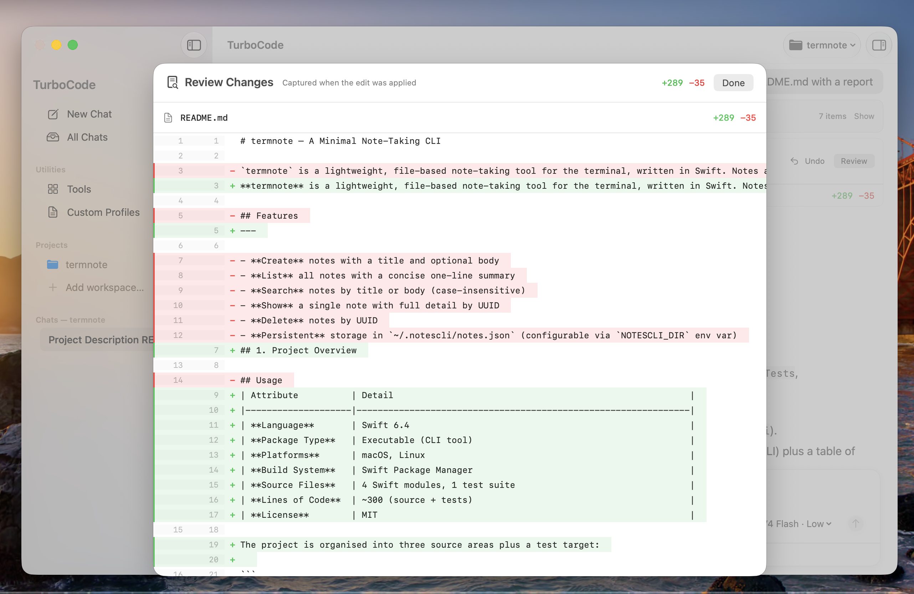
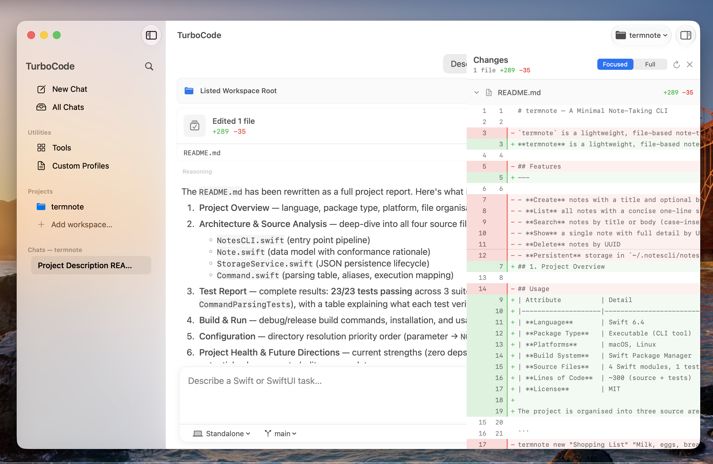
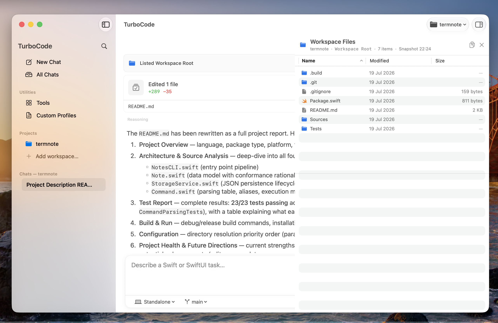
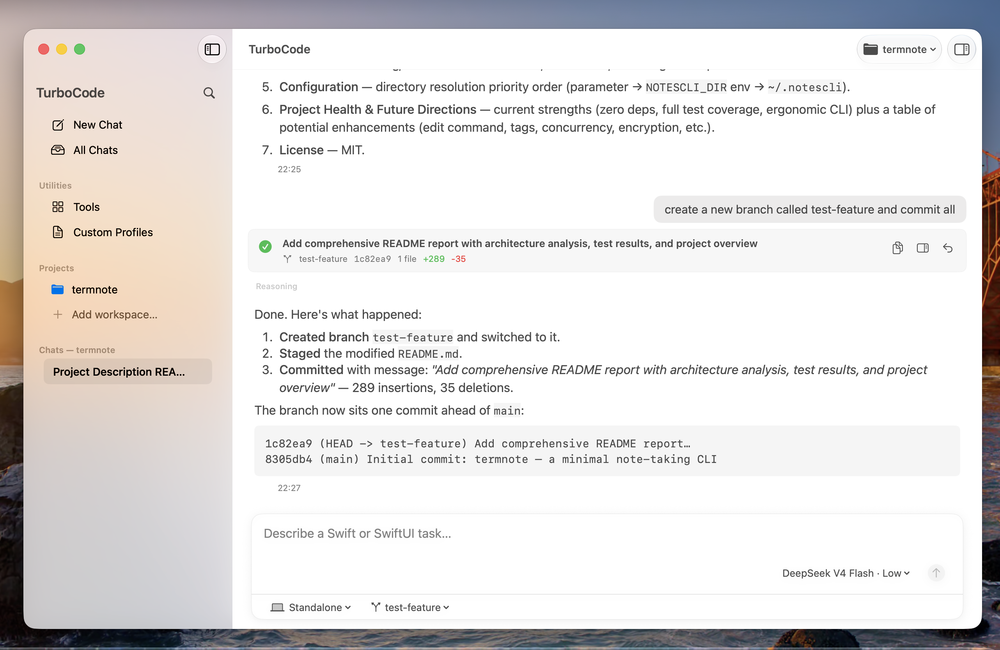
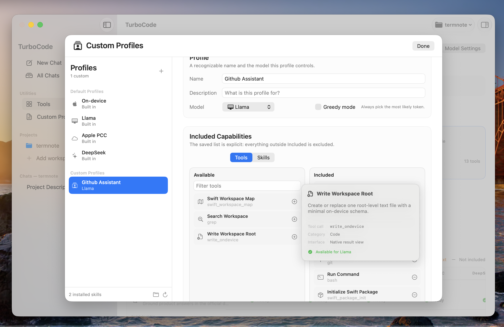
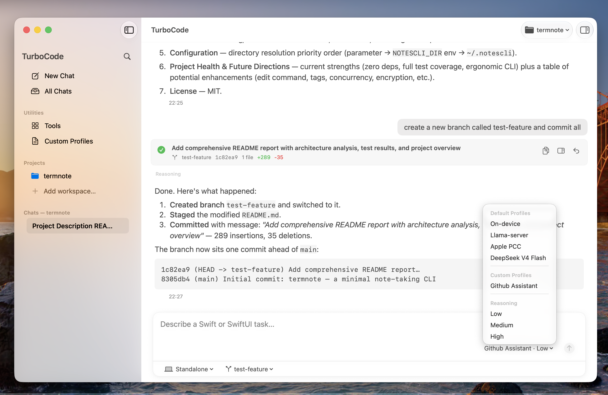
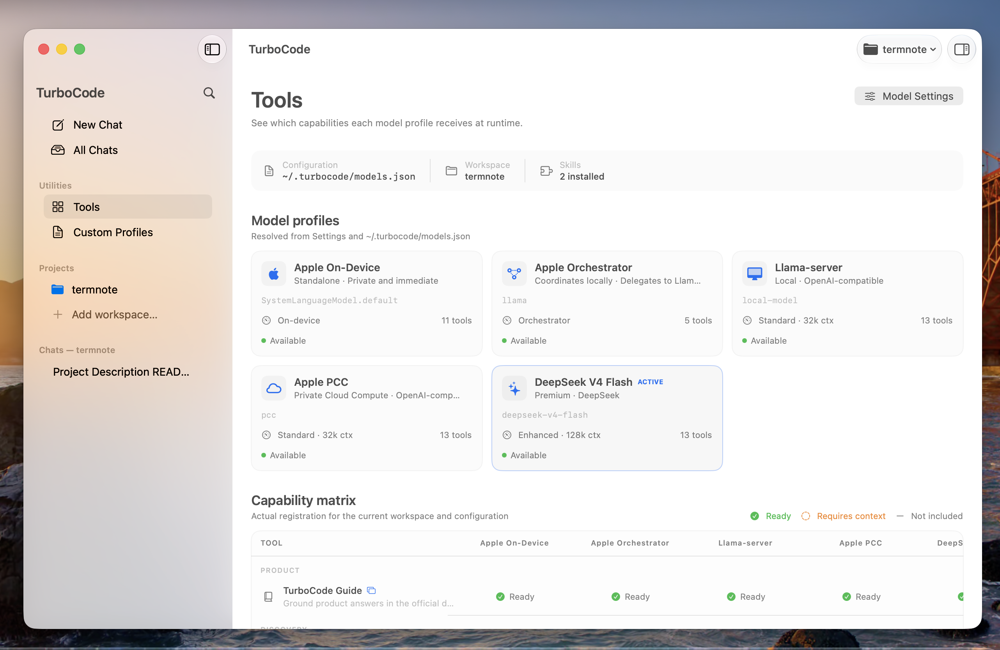

<p align="center">
  
</p>

# TurboCode

**A native macOS agent harness for Swift and Xcode.**

TurboCode is an open-source agent harness written entirely in Swift for native
Apple development. It is built around SwiftUI, AppKit, and Apple's Foundation
Models framework on macOS 27. The agent toolchain has no JavaScript or
TypeScript runtime: model interaction, typed tool calls, routing, context
management, and safety boundaries are implemented in Swift.

TurboCode is designed to work across Apple on-device models, local Llama
servers, Codex, DeepSeek, and Apple Private Cloud Compute through `fm serve`.
The current release also includes experimental support for a complete agent
loop on local models, using Foundation Models capabilities such as
`DynamicProfile`, summarization, context compaction, removal of obsolete tool
calls, and on-demand activation of tools and Skills.

The central workflow is **Coordinator → Worker**. A capable model such as
Codex or DeepSeek can plan a task and delegate implementation or subtasks to a
smaller model, while TurboCode tracks progress, enforces task boundaries, and
verifies the result. The system is specialized for Swift, SwiftUI, Xcode
projects, and Swift Package Manager packages, with structured tools for
workspace inspection, editing, building, testing, diagnostics, and Git. These
operations run within explicit safety boundaries rather than relying on an
unrestricted or opaque shell workflow.

The interface is native macOS software, built with SwiftUI and AppKit and
aligned with Apple's Human Interface Guidelines. TurboCode also supports
workspace-specific `AGENTS.md` instructions and reusable Skills, allowing the
harness to adapt its behavior to the project while keeping consequential work
reviewable.

> [!IMPORTANT]
> TurboCode 0.2.0 is a structured agent-loop release under active development. It targets macOS 27, Xcode 27, and Swift 6.



## Philosophy

### Memory under control

TurboCode uses **less than 70 MB** of memory when idle. For context: Codex uses about 600 MB, Pi about 120 MB. This is not a secondary detail: it means TurboCode can sit comfortably in the background while Xcode, simulators, and browsers share the same machine.

### A Swift-first product boundary

TurboCode is intentionally focused on Apple-platform development. Its tools,
model profiles, Skills, and safety policies are designed for Swift, SwiftUI,
Xcode projects, Swift Package Manager packages, and local Git workflows. It is
not intended to become a general-purpose, multi-language IDE or an opaque
desktop automation agent.

### A native interface that follows the HIG

TurboCode follows Apple's **Human Interface Guidelines** using native SwiftUI
and AppKit behavior for windows, sidebars, inspectors, settings, focus, and
accessibility. Progressive disclosure keeps workspaces, past sessions, and
tools visible without overwhelming the main conversation.

## What it does

### 1. A structured conversation, not just text

The conversation with the agent is not purely textual. Structured tools render
diffs, Git status, file listings, and diagnostics as native, navigable views.
TurboCode uses Apple's **`@Generable`** macro to describe and decode some of
these structured results. This includes:

- An **integrated diff checker** for seeing changes line by line
- A **visual Git status summary** that groups staged, modified, and untracked files
- A traceable Git loop for commit, branch, merge, rebase, and remote operations
- Revision-aware Undo and Review against the real working tree

<table>
  <tr>
    <td width="50%"></td>
    <td width="50%"></td>
  </tr>
</table>

### 2. An intelligent repository map

TurboCode maps the workspace through compact Swift declarations, relationships between files, imports, and source locations. The **map depth is adaptive**: lighter for local models, richer for powerful backends. Results are cached for fast reuse. Repository-specific instructions in `AGENTS.md` are loaded into the session without exposing files outside the active workspace.



### 3. Visible and traceable Git

Git operations—branch, staging, commit, merge, rebase, remote, pull, and
push—are exposed through structured tools in the conversation flow. Git
changes remain reviewable before they are applied. Where shell access is
available for non-Git inspection or commands not covered by a structured tool,
it is bounded by the active workspace, execution policy, timeout, and output
limits.



### 4. Build, test, diagnostics

TurboCode inspects the Xcode project, runs builds and unit tests, and reports compiler diagnostics directly in the conversation. For standalone packages, one structured Swift Package Manager tool handles initialization, dependencies, resolution, build, test, run, cleanup, and package inspection.

### Xcode is a runtime prerequisite

The full Xcode suite is required even when the active workspace contains only
a standalone Swift package. TurboCode's Xcode tool calls depend on Xcode
project and scheme discovery, Apple SDKs, compiler and test destinations,
xcrun, xcodebuild, and structured xcresult diagnostics. The Command Line Tools
alone are not sufficient for the supported Xcode workflow.

You do not need to keep the Xcode UI open while using TurboCode, but Xcode 27
must be installed, launched once to accept its license and install requested
platform components, and selected as the active developer directory. Verify
the active toolchain with:

~~~shell
xcodebuild -version
xcode-select -p
~~~

For an Xcode project or workspace, TurboCode discovers schemes and invokes the
selected toolchain. For a standalone Swift package, TurboCode can perform the
package workflow without opening Xcode, but the full Xcode installation remains
the supported release prerequisite.

## Model profiles

TurboCode comes with preconfigured profiles for several model runtimes.

| Backend | Setup |
| --- | --- |
| **Apple Foundation Models (on-device)** | Runs locally through Apple's framework; no server or API key required. |
| **Apple PCC** | Uses the local Foundation Models bridge while `fm serve --port 1976` is running. |
| **Llama / OpenAI-compatible** | Connects to a local server such as `llama-server`; example endpoint: `http://127.0.0.1:8080/v1`. |
| **Codex** | Uses the official Codex CLI App Server and its ChatGPT sign-in flow; TurboCode does not read Codex credentials. |
| **DeepSeek** | Uses the configured remote API; credentials are entered in Settings and stored in macOS Keychain. |

Apple PCC currently has limited tool-call support through `fm serve` because of
an OpenAI-compatible protocol regression in the current Apple release. PCC
remains available for fast, medium-complexity tasks, but tool-driven workflows
may be affected until Apple stabilizes the protocol.

The profiles use the beta FoundationModels libraries—**`DynamicProfile`**, **`Summary`**, **dynamic tool calls**, **automatic removal of obsolete tool calls**, and **model switching without losing the session** or creating a new one.

### User-customizable profiles

Every profile can be **overridden** by the user. You can manually select which tool calls to enable and create specialized agents:

- A **Git-only** profile that can only perform Git operations
- A **read-only** profile that can read but not write files
- A **reviewer** profile for automatic code review

Custom profiles and reusable Skills live in versioned configurations.

<table>
  <tr>
    <td width="50%"></td>
    <td width="50%"></td>
  </tr>
</table>

## Experimental features

### On-device orchestration

An experimental orchestrator lets the **on-device model act as the entry point**:
it receives the request, analyzes it, and delegates complex operations to a
configured worker model. The result returns to the orchestrator, which presents
it to the user. This provides local responsiveness with additional model
capability when needed.

### Automatic conversation titles

For each session, the on-device model can automatically generate a
**conversation title** by analyzing the initial context instead of using the
user's prompt as the title. This keeps conversation history easier to scan.

## Tools and diagnostics

The **Tools** view resolves model profiles, the selected workspace, installed Skills, and runtime capabilities into a matrix. It is a practical and transparent debugging surface.

- Backend availability
- Context requirements
- Capability matrix
- On-device latency, token, tool-call, and outcome statistics



## Configuration

Non-sensitive data such as endpoints and capabilities lives in `~/.turbocode/models.json`. Agent, execution, Skill, and Git policies live in `~/.turbocode/config.json`. See [CONFIGURATION.md](CONFIGURATION.md) for the complete schema.

## Requirements

- macOS 27 or later
- Xcode 27 or later, full suite installed and selected as the active developer directory
- Swift 6
- A Mac capable of running Apple Foundation Models for the on-device profile
- An optional local model server or remote provider credential for other profiles

## Install from Homebrew

The current 0.2.0 Alpha build is available through the TurboCode Homebrew tap:

```shell
brew install --cask granvalenti76/homebrew-tap/turbocode
```

To update an existing installation:

```shell
brew upgrade --cask turbocode
```

To uninstall TurboCode:

```shell
brew uninstall --cask turbocode
```

The distributed application is ad-hoc signed and is not notarized by Apple.
If macOS blocks the first launch, approve TurboCode in **System Settings →
Privacy & Security**, or open the application once with **right-click → Open**.

## Build from source

Clone the repository, open `TurboCode.xcodeproj`, select the **TurboCode** scheme, and run the macOS app.

Command-line build:

```shell
xcodebuild \
  -project TurboCode.xcodeproj \
  -scheme TurboCode \
  -configuration Debug \
  build
```

Swift Package dependencies are resolved automatically by Xcode. Direct dependencies:

- [Apple Foundation Models Utilities](https://github.com/apple/foundation-models-utilities)
- [MarkdownUI](https://github.com/gonzalezreal/swift-markdown-ui)

## Tests and evaluations

The release gate runs deterministic Swift Testing coverage without starting
Foundation Models:

```shell
Scripts/test-deterministic.sh
```

Golden evaluations use a separate, timeout-bounded command. They may vary with
macOS 27 betas and Foundation Models changes, so they remain experimental
signals rather than release gates. See [TESTING.md](TESTING.md) for both paths.

## Privacy and safety

- Apple on-device inference stays local.
- Local OpenAI-compatible inference stays local when a local endpoint is used.
- Remote requests are sent only to the backend selected by the user.
- Credentials are stored in macOS Keychain, not in TurboCode's JSON files.
- File tools validate paths against the active workspace.
- Source edits are revision-bound and presented for review.
- Destructive file and Git operations have explicit approval boundaries.
- Diagnostics exclude prompts, generated source, file contents, and workspace paths.

TurboCode is software under development and should not be treated as a security boundary. Review generated changes and Git operations before publishing them.

## Project status

Working now:

- Workspace and session persistence
- Built-in and custom model profiles
- Reviewable, revision-bound edits
- Repository maps and structured Git tools
- Xcode and Swift Package Manager inspection, builds, and tests
- Codex App Server integration and model handoff
- Workspace `AGENTS.md` instructions
- Git status visualization and on-device model statistics
- Session Summary App Shortcut
- Versioned configuration and Keychain-backed credentials

Still to improve:

- Some secondary controls and advanced approval flows remain under active
  development
- Model behavior varies considerably between backends
- Setup assumes familiarity with Swift tooling
- Compatibility is limited to recent development releases
- Clean-install testing and documentation are ongoing

For a visual overview and the latest project notes, visit [granvalenti.art/turbocode](https://granvalenti.art/turbocode/).

## License

TurboCode is available under the [MIT License](LICENSE).
