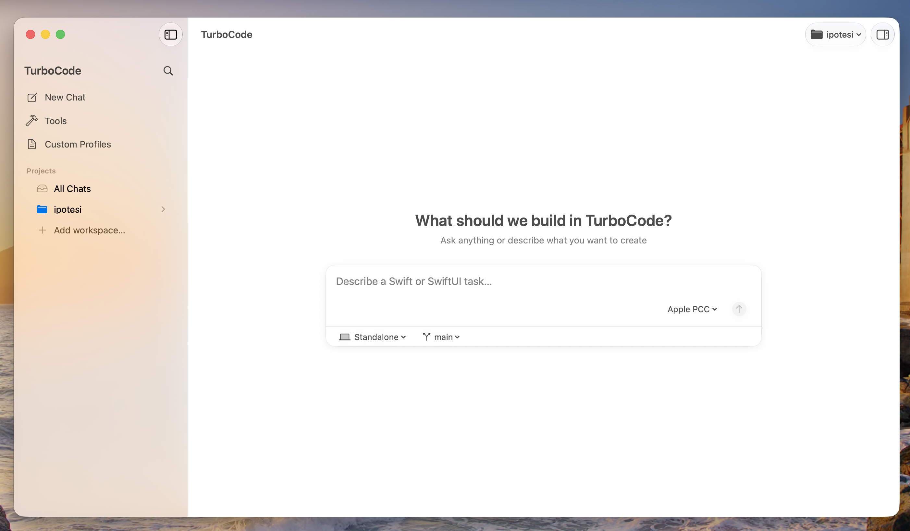
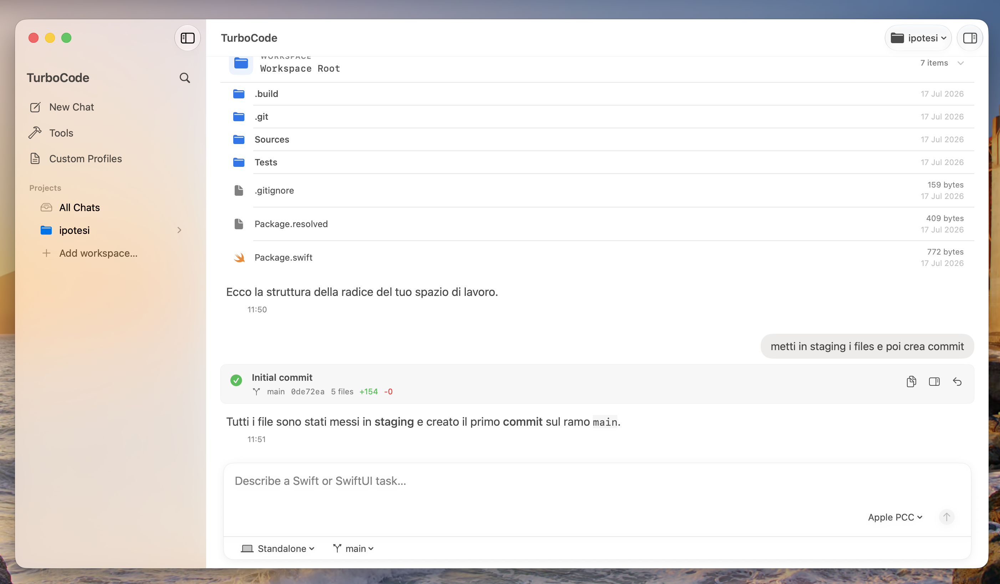
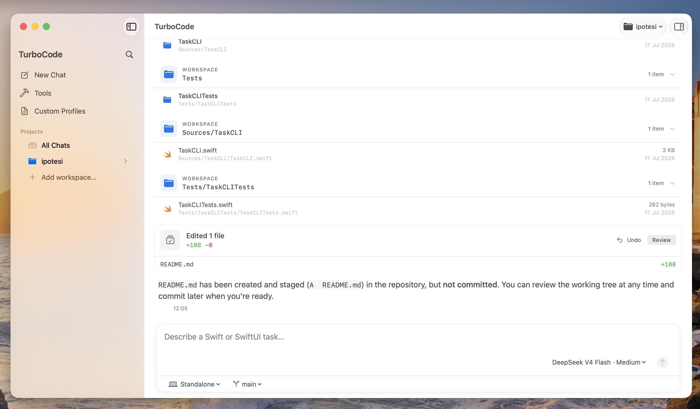
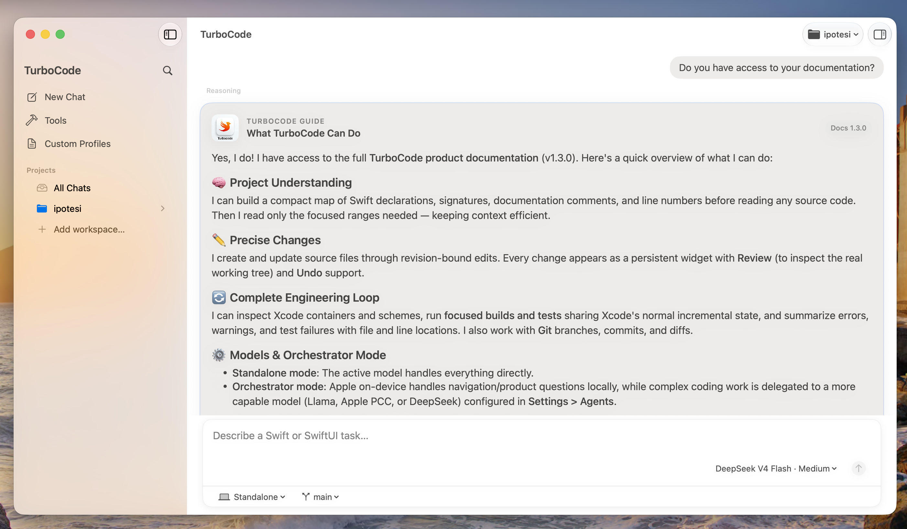
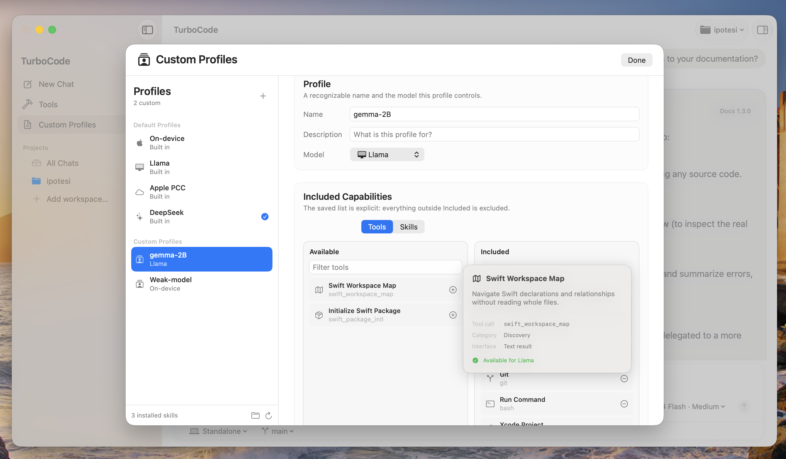
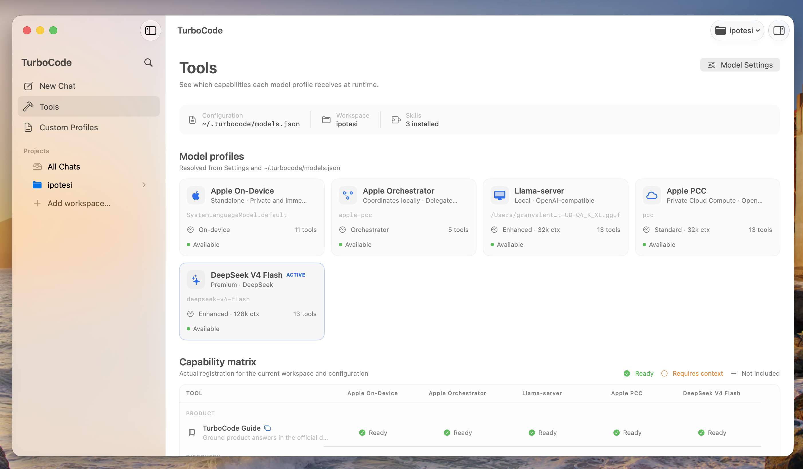

<p align="center">
  
</p>

# TurboCode

**A native place to try coding agents on Swift projects.**

TurboCode is a small, open-source macOS app for exploring how different language models can read, change, build, test, and manage Git-backed Swift projects without leaving a native workspace.

It is a personal experiment built around a narrow idea: give models well-bounded tools for Swift, keep their actions inspectable, and make the result easy to review or undo. TurboCode is not intended to replace Xcode or pretend that a model can run a software project on its own.

> [!IMPORTANT]
> TurboCode is a working prototype under active development. It currently targets macOS 27, Xcode 27, and Swift 6.



## What works

### Keep the conversation close to the repository

TurboCode can inspect the active workspace, show file results inline, and expose ordinary Git operations without turning them into invisible background work.

- Workspace-bound file access
- Branches, staging, commits, merges, rebases, remotes, pull, and push
- Conversation history per project



### Make edits reviewable and reversible

File changes are tied to a known revision and remain visible in the conversation. Review opens the real working tree, and Undo remains available while that revision is still current.

- Visible addition and deletion counts
- Review against the working tree
- Revision-aware Undo



### Let the model consult the app's own guide

A bundled, versioned guide explains TurboCode's tools and constraints to the active model. Product questions and tool use can rely on a visible source instead of a large hidden prompt.

- Versioned local documentation
- Focused Swift repository maps
- Context kept close to the task



### Give smaller models a smaller job

Built-in and custom profiles define which tools and Skills a model receives. A compact local model can work with a short, explicit capability list, while a more capable backend can receive richer project and diagnostic tools.

- Built-in and custom profiles
- Explicit tool selection
- Reusable local Skills



### Inspect the active configuration

The Tools view resolves model profiles, the selected workspace, installed Skills, and runtime capabilities into one matrix. It is intentionally a practical debugging surface.

- Backend availability
- Context requirements
- Capability matrix



## Current workflow

1. Map the workspace through compact Swift declarations, relationships, imports, and source locations.
2. Read and edit files through workspace-bound, revision-aware operations.
3. Inspect, build, and test with Xcode's build system.
4. Review compiler diagnostics, file changes, and Git state in the conversation.
5. Commit or recover while keeping consequential actions visible.

## Model backends

TurboCode ships with example profiles for several locally configured backends.

| Backend | Setup |
| --- | --- |
| Apple Foundation Models | Runs on device through Apple's framework; no server or API key required. |
| Apple PCC | Uses Apple's local Foundation Models bridge while `fm serve --port 1976` is running. |
| OpenAI-compatible local model | Connects to a local server such as `llama-server`; the example endpoint is `http://127.0.0.1:8080/v1`. |
| DeepSeek | Uses the configured remote API; the credential is entered in Settings and stored in the macOS Keychain. |

Non-secret endpoint and capability data lives in `~/.turbocode/models.json`. Agent, execution, Skill, and Git policies live in `~/.turbocode/config.json`. See [CONFIGURATION.md](CONFIGURATION.md) for the complete schema.

## Requirements

- macOS 27 or later
- Xcode 27 or later
- Swift 6
- A Mac capable of using Apple Foundation Models for the on-device profile
- Optional local model server or remote provider credential for other profiles

## Build from source

Clone the repository, open `TurboCode.xcodeproj`, select the **TurboCode** scheme, and run the macOS app.

The command-line build is:

```shell
xcodebuild \
  -project TurboCode.xcodeproj \
  -scheme TurboCode \
  -configuration Debug \
  build
```

Swift Package dependencies are resolved automatically by Xcode. The direct dependencies are:

- [Apple Foundation Models Utilities](https://github.com/apple/foundation-models-utilities)
- [MarkdownUI](https://github.com/gonzalezreal/swift-markdown-ui)

## Tests and evaluations

The `TurboCodeEvaluations` scheme contains focused Swift Testing coverage alongside experimental, model-backed golden evaluations:

```shell
xcodebuild test \
  -project TurboCode.xcodeproj \
  -scheme TurboCodeEvaluations \
  -destination 'platform=macOS'
```

The deterministic tests cover workspace boundaries, file operations, Git behavior, session search, configuration, diagnostics, and dynamic profiles. Golden evaluations exercise model behavior and can vary with macOS 27 beta releases and Foundation Models changes; they are experimental signals rather than release gates for the application.

## Privacy and safety

- Apple on-device inference remains local.
- Local OpenAI-compatible inference remains local when a local endpoint is used.
- Remote requests are sent only to the backend selected by the user.
- Credentials are stored in the macOS Keychain, not in TurboCode's JSON configuration.
- File tools validate paths against the active workspace.
- Source edits are revision-bound and presented for review.
- Destructive file and Git operations have explicit approval boundaries.
- Diagnostics avoid prompts, generated source, file contents, and workspace paths.

TurboCode is still development software and should not be treated as a security boundary. Review generated changes and Git operations before publishing them.

## Project status

Working now:

- Workspace and session persistence
- Built-in and custom model profiles
- Reviewable, revision-bound edits
- Repository maps and structured Git tools
- Xcode project inspection, builds, and tests
- Versioned configuration and Keychain-backed credentials

Still rough:

- Some composer and secondary controls are incomplete
- Approval flows need broader testing
- Model behavior varies considerably between backends
- Setup assumes familiarity with Swift tooling
- Compatibility is limited to recent development releases
- Clean-install testing and documentation are ongoing

For a visual overview and the latest project notes, visit [granvalenti.art/turbocode](https://granvalenti.art/turbocode/).

## License

TurboCode is available under the [MIT License](LICENSE).
